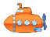
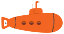
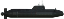
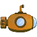
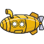
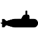
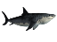
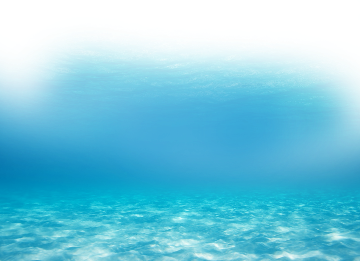
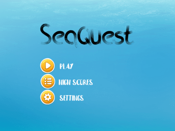

# GEX2023_CapstoneProject - SeaQuest

- [Table Of Contents](#gex2023_capstoneproject---seaquest)
  - [1. Executive Summary](#1-executive-summary)
  - [2. Game Description](#2-game-description)
    - [2.1 Overview](#21-overview)
    - [2.2 The Quest](#22-the-quest)
    - [2.3 Main Character](#23-main-character)
    - [2.4 Sketch of Main Character](#24-sketch-of-main-character)
    - [2.5 Opponents](#25-opponents)
    - [2.6 Sketch of Opponents](#26-sketch-of-opponents)
    - [2.7 Environment](#27-environment)
    - [2.8 Sketch of World](#28-sketch-of-world)
    - [2.9 Menu](#29-menu)
    - [2.10 Controls](#210-controls)
    - [2.11 Sounds](#211-sounds)
  - [3. Summary](#3-summary)
  - [4. References](#4-references)

## 1. Executive Summary

**Seaquest** is an action, shoot-them-up, horizontal game where the player controls a submarine and needs to rescue divers while avoiding being hit by enemies’ submarine missiles and sharks.

Initially released by Activision in 1983 for the Atari 2600 consoles, **Seaquest** is being rewritten in C++ using SFML to bring back the fun of the 80s with slightly more updated graphics, music and sound effects.

---

## 2. Game Description

- ### 2.1. Overview

    The game is about a submarine that rescues divers from seawater while the oxygen stock lasts. Enemies, including other submarines and sharks, are also in the water and will keep trying to kill the player’s submarines.

    The enemy submarines can kill the player by contact – colliding with its submarine to the player’s submarine – or by shooting and hitting missiles at the player’s sub.

    Sharks can kill the player only by contact – colliding themselves with the player’s submarine.

    The player must avoid or kill enemies by firing an unlimited supply of missiles while trying to rescue divers by swimming through the water.

    No Health Points exist, meaning every single missile shot can kill one enemy or the player’s submarine. The same is true for collisions. Any collision kills both entities that have collided.

    Every enemy killed by the player will give them 10 points. This amount increases as the game progresses.

    The player’s submarine can carry up to six divers at a time. Each time the player respawns to the surface before having a whole load of six divers, one of the divers is removed.

    The player’s submarine has a limited amount of oxygen. The player must frequently surface to replenish oxygen. The player loses one life if they respawn to the surface with no diver rescued.

    If the player respawns with the maximum number of divers, he will gain bonus points for the submarine’s remaining oxygen. Also, the game’s difficulty increases; enemies increase in number and speed. Eventually, an enemy submarine starts patrolling the surface, leaving the player without a safe place to stay.

    The player starts the game with three extra lives and gets an extra life each time the player scores 10,000 points.

    **Seaquest** is a single-player game.

- ### 2.2 The Quest
  
    **Seaquest** is a survival, non-ending game. The objective is to remain alive, saving divers and avoiding being killed as long as the player can. The top five high scores can be accessed through the main menu.

    The more enemies are killed, and the more divers are saved, the player earns more points, and the game increases its difficulty.

- ### 2.3. Main Character
  
    The main character is a submarine that can load up to six divers at once and shoot simple subaquatic missiles. The main character’s movement speed remains the same throughout the game, no matter how far the player goes or how difficult the enemies are.

- ### 2.4. Sketch of Main Character

    The main character, the player’s submarine, will look like this:

    

- ### 2.5. Opponents
  
    In the original 1983 game, there was only one type of enemy sub underwater and another that patrols the surface. There was only one type of shark, also.
    In this version, the idea is to spawn at least two different enemy submarine types. Each one will have its fire rate—the same idea for sharks. At least two types of sharks, and each one will spawn in different shoals size.
    The enemy subs and sharks will cross the screen in a left-right or right-left way. Sharks swim by varying their position vertically, up and down, while moving horizontally.

- ### 2.6. Sketch of Opponents
  
    Sketch of enemies sub appearance:

    
    
    
    
    

    Sketch of sharks appearance:

    
    
    
    

- ### 2.7. Environment

    **Seaquest** has a pretty straightforward environment. An underwater scenario and the top screen showing the horizon, the sky, and the water’s surface.

- ### 2.8. Sketch of World
  
    **Seaquest** world will look like this:

    

- ### 2.9. Menu
  
    The main menu has three options. Play the game, see the high scores, and go to the settings, where the player can toggle on or off the music and the sound effects.

   

- ### 2.10. Controls

    **Seaquest** can be played using only the PC’s keyboard. The following keys are mapped to move the submarine:

        W or Arrow Up key = Move submarine up
        S or Arrow Down key = Move submarine down
        A or Arrow Left key = Move submarine left
        D or Arrow Right key = Move submarine right

    Also, the following keys are mapped:

        Spacebar, left-control or left-shift = Shoots one missile
        P = Pauses the game
        Escape key = freezes the game and returns to the main menu
        Q = Quit the game and return to the main menu

- ### 2.11. Sounds
  
    **Seaquest** has background music and several sound effects. Both can be disabled from playing using the settings option on the main menu.

    The sound effects include firing missile sounds, replenishing oxygen sound, oxygen-running-out warning sounds, rescuing divers sound, collision sound, and the passing level sound.

---

- ### 3. Summary
  
    Designed to be straightforward, people of all ages can play **Seaquest**. Made for people who like challenges or being among the best, or simply for those who want to check how far you can go in an underwater shoot-them-up battle where only the most skilled survive.

---

- ### 4. References
  
    All sketches in this document are free-to-use images from the website [PngWing](https://www.pngwing.com/)

    Submarines:

    [https://www.pngwing.com/en/free-png-ysiil](https://www.pngwing.com/en/free-png-ysiil)

    [https://www.pngwing.com/en/free-png-ywdpv](https://www.pngwing.com/en/free-png-ywdpv)

    [https://www.pngwing.com/en/free-png-czbij](https://www.pngwing.com/en/free-png-czbij)

    [https://www.pngwing.com/en/free-png-nudbr](https://www.pngwing.com/en/free-png-nudbr)

    [https://www.pngwing.com/en/free-png-tuzhb](https://www.pngwing.com/en/free-png-tuzhb)

    [https://www.pngwing.com/en/free-png-ysiep](https://www.pngwing.com/en/free-png-ysiep)

    Sharks:

    [https://www.pngwing.com/en/free-png-viagf](https://www.pngwing.com/en/free-png-viagf)

    [https://www.pngwing.com/en/free-png-ydpcy](https://www.pngwing.com/en/free-png-ydpcy)

    [https://www.pngwing.com/en/free-png-mcawz](https://www.pngwing.com/en/free-png-mcawz)

    [https://www.pngwing.com/en/free-png-phhjl](https://www.pngwing.com/en/free-png-phhjl)

    World:

    [https://www.pngwing.com/en/free-png-bnzvd](https://www.pngwing.com/en/free-png-bnzvd)
